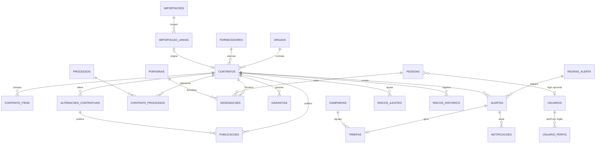

# SIGC – Sistema Integrado de Gestão de Contratos · Fase de arquitetura

Esta fase transforma o diagnóstico (`../diagnostico/DIAGNOSTICO_PLANILHA_GERAL_CONTRATOS.md`) em três entregas:

1. **Schema PostgreSQL/Supabase**, executável e testado: [`sql/`](sql/)
2. **Catálogo de regras de negócio** com casos de teste: [`REGRAS_DE_NEGOCIO.md`](REGRAS_DE_NEGOCIO.md) e [`testes/`](testes/)
3. **Wireframes** de baixa fidelidade das telas do MVP: [`WIREFRAMES.md`](WIREFRAMES.md)

O front-end ainda não foi implementado. Ele é a próxima fase e depende da aprovação desta.

---

## 1. Isolamento: o que esta fase NÃO toca

| Item | Situação |
|---|---|
| GT PROPAG (`src/`, `supabase/migrations/`, `package.json`, `netlify.toml`) | **Inalterado** |
| Projeto Supabase do GT PROPAG | **Não acessado** |
| Outros sistemas, como o monitoramento da carteira de projetos | **Não acessados.** Esta sessão só tem acesso a este repositório |
| Onde o SQL do SIGC vive | `docs/arquitetura/sql/`, fora da pasta de migrations. Nada é aplicado automaticamente |
| Onde foi testado | Postgres 16 local e descartável, com um "stub" mínimo do Supabase (`testes/00_stub_supabase.sql`) |
| Implantação recomendada | **Projeto Supabase próprio** + projeto **Vercel** próprio. Nenhum banco é compartilhado com outro sistema |

## 2. Premissas adotadas no lugar das respostas da seção 29.2

As 10 perguntas continuam em aberto. Para não travar a arquitetura, cada uma virou um **parâmetro editável**, com um padrão conservador e a marcação `a_validar` (aparece na tela Administração). Responder a pergunta significa mudar um valor, não reescrever o schema.

| Nº | Pergunta | Padrão adotado | Onde mudar |
|---|---|---|---|
| 1 | Convenção de término | O término escrito no termo **prevalece**. Só sem término o sistema calcula, por `EDATE − 1`. Toda divergência vira DQ-TERM (tolerância 0) | `vigencia.convencao_termino` (global ou por órgão), regra DQ-TERM |
| 2 | N/C, `****`, `XXX` | `N/C` = não se aplica. `****`, `***`, `XXX`, `-` = não informado | `importacao.marcadores_*` |
| 3 | Coluna Y e portarias SEDECSCTI | A coluna Y vira **campanha** "Apostilamento de troca do órgão contratante", com uma tarefa por contrato. O emissor da portaria é guardado como escrito ("SEDECSCTI") | `importacao.campanha_coluna_y`, `portarias.orgao_emissor_texto` |
| 4 | Coluna L inclui reajustes? Caso ABL | A coluna L é tratada como **valor global original**. Divergências viram DQ-VALOR | regra DQ-VALOR |
| 5 | Prefixo 150001 | Sem órgão associado. Os processos com esse prefixo ficam no órgão da linha | `orgaos.prefixos_sei` |
| 6 | Regime legal dos contratos anteriores a 2024 | "A confirmar" (alerta DQ-REGIME). Para o PNCP, os assinados a partir de 01/01/2024 são presumidos 14.133. Sem regime, não há trava de prorrogação | `pncp.regime_presumido_desde`, `contratos.regime_legal` |
| 7 | Prazo do DOERJ | 20 dias corridos [VALIDAR REGULAMENTAÇÃO ESTADUAL/RJ] | `doerj.prazo_dias` |
| 8 | Nuvem comercial | Arquitetura mantida (Supabase sa-east-1 + Vercel). Decisão institucional pendente | — |
| 9 | SMTP institucional | O banco **gera** as notificações de e-mail (`notificacoes`, canal = email). O envio fica numa Edge Function, configurada quando houver SMTP | Edge Function (fase de desenvolvimento) |
| 10 | Repositório | Os arquivos estão em `docs/arquitetura/`. Na implementação, sugiro **repositório próprio** (`sigc`), e as migrations passam para `supabase/migrations/` de lá | — |

## 3. Arquivos do schema (ordem de aplicação)

| Arquivo | Conteúdo |
|---|---|
| `01_base.sql` | Extensões, tipos (enums), `parametros`, `feriados`, `listas`, datas e dias úteis, `fn_hoje()` com data de referência, normalizadores (texto, CNPJ, processo SEI, marcadores) e contexto de sistema |
| `02_cadastros.sql` | `orgaos` (com `siglas_anteriores` e `prefixos_sei`), `unidades`, `usuarios`, `usuario_perfis`, `pessoas`, `pessoa_afastamentos`, `fornecedores`, `processos`, `portarias` |
| `03_contratos.sql` | `contratos`, `contrato_itens`, `alteracoes_contratuais`, `contrato_processos`, `designacoes` (com restrições de exclusão), `publicacoes`, `garantias` |
| `04_vigencia_valores.sql` | `vw_contrato_vigencia`, `vw_contrato_valores` e travas de prorrogação e de acréscimo |
| `05_importacao.sql` | Staging (`importacoes`, `importacao_linhas`), conversores de célula, normalização, validação, aprovação e fusão de pessoas |
| `06_alertas_tarefas.sql` | `regras_alerta`, `regras_alerta_orgao`, `campanhas`, `alertas`, `tarefas`, `notificacoes` e `vw_alertas_condicoes` (uma condição por regra) |
| `07_motor.sql` | `fn_motor_alertas` (idempotente), `fn_recalcular_contrato`, `fn_rotina_diaria` |
| `08_scores.sql` | Saúde, Risco (com cobertura, materialidade e ajuste manual), Qualidade e histórico de risco |
| `09_auditoria.sql` | Trilha somente de inserção, motivo obrigatório e soft delete |
| `10_seguranca_rls.sql` | Funções de perfil, RLS em todas as tabelas, restrições por coluna e grants |
| `11_paineis.sql` | Views de tela: carteira, cards, régua, Top 10, carga, publicações no prazo, qualidade, pendências e campanhas |
| `12_carga_configuracao.sql` | Órgãos SEDES (sigla anterior SEDEICS) e SEENEMAR, parâmetros, 26 regras de alerta (24 ativas; FIN-EXEC e SLA-OCOR aguardam a fase 2) e feriados 2026–2027 (os mesmos do GT PROPAG). **Nenhum dado de contrato** |
| `13_agendamentos.sql` | pg_cron: `fn_rotina_diaria()` às 07:00 de Brasília. Só roda no Supabase |

### Modelo (resumo)



### Decisões de desenho

| Decisão | Por quê |
|---|---|
| **Vigência, situação, valores e scores são views**, não colunas | O dado calculado nunca fica desatualizado. O que a planilha errava por digitação (término), o sistema calcula |
| **`orgao_id` repetido nas tabelas filhas**, herdado do contrato por gatilho | A RLS vira um filtro simples por órgão, sem subconsulta, e o registro não pode ser movido para outro contrato |
| **Motor = view de condições + função de conciliação** | Cada regra é um bloco SQL legível e testável. O motor só compara o que é verdade hoje com o que está aberto: abre, atualiza ou fecha |
| **Bloqueio × alerta** | Bloqueia o que é **erro objetivo**: duplicidade no mesmo papel, limite legal na assinatura, original importado. Só alerta o que **depende de confirmação**: segregação gestor × fiscal, regime, prazos estaduais |
| **Motivo como "campo de passagem"** | O cliente envia `motivo_alteracao` no próprio UPDATE. O gatilho valida, registra na trilha e limpa a coluna, sem chamada extra nem tabela intermediária |
| **Período vigente importado com `historico_incompleto`** | A planilha traz o período atual (pós-aditivo), não o contrato original. Inventar o original seria criar dado; o alerta DQ-HIST pede o cadastro |
| **`fn_hoje()` com data de referência** | Testes e reprocessamentos são reproduzíveis (`set sigc.data_referencia = '2026-10-07'`) |
| **Contexto de sistema** | O motor e o cron passam pelas restrições de perfil. A API não consegue ativar esse contexto |

## 4. Testes

```bash
# Requer Postgres 16 local com acesso de superusuário (cria e apaga o banco sigc_teste)
docs/arquitetura/testes/rodar.sh
```

- `t10` vigência e valores · `t20` motor de alertas · `t30` saúde, risco e painel · `t40` segurança (RLS, perfis, motivo, auditoria, soft delete) · `t50` importação.
- **146 verificações, todas passando**. Cada arquivo roda numa transação desfeita no fim, e todos os dados são DEMO.

### Teste de aceite com a planilha real (seção 27 do diagnóstico)

```bash
python3 -I testes/aceite/planilha_para_json.py "PLANILHA GERAL DE CONTRATOS.xlsx" /tmp/planilha.json
psql -d sigc_teste -v arquivo=/tmp/planilha.json -f testes/aceite/aceite_planilha.sql
```

O JSON contém nomes e matrículas, então **não deve ser versionado**. O script imprime apenas totais. Resultado em 07/10/2026:

| Critério | Diagnóstico | Sistema | Observação |
|---|---|---|---|
| Linhas por órgão | SEDES 17 + Descentralização 1, SEENEMAR 22 | SEDES 18 (inclui a Descentralização), SEENEMAR 22 | A Descentralização e a L12 foram atribuídas à SEDES pelo prefixo 220001 (aviso IMP-ORGAO-PREFIXO, a confirmar) |
| Instrumentos com início | 34 | **34** | ✔ |
| Em formalização | 6 | **6** | ✔ |
| Valor total | R$ 37.281.765,18 | **R$ 37.281.765,18** | ✔ |
| Valor por órgão | SEDES R$ 14.004.620,12 · SEENEMAR R$ 23.277.145,06 | **iguais** | ✔ |
| Vencidos | 11 | 10 | O 11º do diagnóstico era a LIGHT, cujo término (24/03/2025) é anterior ao início. O sistema descarta esse término e calcula pelo início + prazo (10/12/2026) |
| Valor vigente | R$ 24.444.726,44 | R$ 24.824.726,44 | +R$ 380.000 = LIGHT (R$ 50.000) + L13 (R$ 330.000, sem término na planilha; o sistema calcula pelo início + prazo) |
| Vencem em ≤ 30 dias / ≤ 60 dias | 2 / 3 | **2 / 3** | ✔ (VIG-030 e VIG-060) |
| Divergências de término | 16 | **16** (IMP-TERM-DIV) | ✔ |
| Número duplicado em L38 | apontado | **bloqueado** (IMP-DUP) até a revisão | No aceite, o revisor tira o número da L38. O original fica preservado |
| Pessoas | 45 (estimativa com normalização manual) | 50 cadastros + **4 pares** sinalizados para fusão | Variações como "Jr" × "Junior" não são fundidas automaticamente (`fn_fundir_pessoas`) |
| Inconsistências viram pendência | exigido | **221 alertas** e 132 tarefas na 1ª execução do motor | GAR-PEND (16) aparece porque a garantia é "SIM" e não há dados de apresentação [DADO AUSENTE] |

## 5. Decisões registradas (07/10/2026)

| # | Tema | Decisão | Efeito no schema |
|---|---|---|---|
| 1 | Volume inicial de pendências | DQ-CNPJ, DQ-REGIME e DQ-HIST aparecem só na tela Qualidade dos Dados, sem tarefa | `regras_alerta.gera_tarefa = false` nessas três (já era o padrão) |
| 2 | Garantias | A área cadastrará as garantias; GAR-PEND continua ativa | Sem mudança na regra; anotado em `a_validar` |
| 3 | Fiscalização regular | Mantido o critério estrito (gestor, fiscal, substituto e portarias publicadas) | `vw_contrato_fiscalizacao` |
| 4 | Mesma pessoa em dois papéis | **Só alerta**, com mensagem recomendando atores distintos, **sem bloquear a operação** | FIS-SEG com recomendação; `fn_aviso_segregacao` para a tela; aviso IMP-PESSOA-DUP na importação |
| 5 | Repositório | Repositório próprio (`sigc`), privado | Ver seção 6 |

Ponto ainda aberto: **processos compartilhados entre órgãos** (P27). O mesmo processo de pagamento aparece em dois contratos e fica no órgão da primeira linha importada. Se houver processos de fato compartilhados entre SEDES e SEENEMAR, a visibilidade precisa ser revista.

**Dados pessoais.** Os documentos não trazem nomes nem matrículas de servidores (substituídos por letras e exemplos fictícios). A planilha e o JSON do aceite nunca são versionados.

## 6. Próxima fase (desenvolvimento do MVP), após aprovação

1. Criar o repositório e o projeto Supabase do SIGC. Mover `sql/01..13` para `supabase/migrations/` e aplicar. Gerar os tipos TypeScript.
2. Front-end React + Vite na Vercel. As telas seguem os wireframes, nesta ordem: Importação → Carteira e Ficha → Painel → Pendências → Qualidade → Administração.
3. Edge Functions: leitura do .xlsx (a mesma conversão de `planilha_para_json.py`; em células mescladas o valor fica na primeira célula, e linhas que só repetem a mesclagem são ignoradas como vazias) e envio de e-mail.
4. Carga real da planilha pela tela de importação, com revisão e aprovação por duas pessoas.
