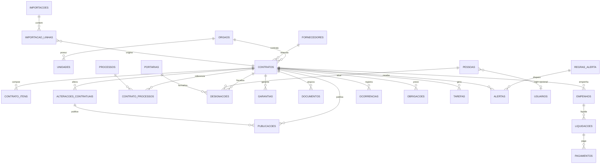

# Diagnóstico da PLANILHA GERAL DE CONTRATOS e proposta de arquitetura

**Fase 01–02: análise e diagnóstico.** Este documento não contém código.

| | |
|---|---|
| Fonte | `PLANILHA GERAL DE CONTRATOS.xlsx`, aba `CONTRATOS SEDEICS e SEENEMAR  `, com "DATA DE ATUALIZAÇÃO: 25/09/2026" |
| Data de referência da análise | **07/10/2026**. A planilha calcula a situação com `=TODAY()`; aqui a data foi fixada para que os números possam ser reproduzidos |
| Método | Leitura célula a célula: valores, fórmulas, mesclagens, validações de lista e cores. Os scripts estão em [`auditoria/`](auditoria/) |
| Convenções | **[DADO AUSENTE]** marca o que a planilha não informa. **[REQUISITO A VALIDAR]** e **[REGRA A CONFIRMAR]** marcam decisões da área. **[VALIDAR REGULAMENTAÇÃO ESTADUAL/RJ]** marca normas estaduais que não foram verificadas |
| Linha da planilha | "L30" significa a linha 30 do Excel, para que cada achado possa ser conferido no arquivo |
| **Nome do órgão** | A planilha usa a sigla **SEDEICS** (coluna A, nome da aba e cabeçalho L1–L3). O nome correto do órgão é **SEDES**. Neste documento, "SEDES" abrange as linhas marcadas como SEDEICS (L17–L29) e as demandas da SEDES (L12–L16). Na importação, o valor "SEDEICS" é mapeado para SEDES e o texto original fica preservado |

---

## Nome institucional do produto

O prompt propõe o nome provisório **ContractGov RJ**. Recomendo trocá-lo, por três motivos.

1. **O nome está em inglês.** Isso destoa do padrão de sistemas da Administração Pública fluminense (SEI-RJ, SIAFE-Rio, SIGA) e dificulta a comunicação com o Controle Interno e a Auditoria.
2. **A planilha já é multiórgão.** Uma única DGAF controla contratos da **SEDES** e da **SEENEMAR**, além de uma linha "DESCENTRALIZAÇÃO". O nome não pode carregar a sigla de nenhuma secretaria, e o órgão deve ser um atributo do dado, não da marca.
3. **O nome deve sobreviver a reorganizações.** A própria planilha ainda usa a sigla antiga SEDEICS para contratos que hoje são da SEDES e mostra uma reestruturação em curso, com portarias "SEDECSCTI" e a coluna "Apostilamento p/ SEDEICSCTI".

**Proposta: SIGC, Sistema Integrado de Gestão de Contratos.**
Subtítulo: *Inteligência, Governança e Gestão de Contratos*.
Em cada tela aparece o órgão ativo, por exemplo "SIGC · SEDES". O nome do produto não muda quando o órgão muda.

| Alternativa | Comentário |
|---|---|
| **SIGC** (recomendada) | É neutra, descritiva e segue o padrão de sigla dos sistemas estaduais |
| Painel de Contratos | Simples, mas não comunica governança |
| Observatório de Contratos | Combina com a vocação analítica, mas soa como algo apenas de consulta |

[REQUISITO A VALIDAR] Antes de adotar o nome, a ASCOM e o PRODERJ precisam confirmar que nenhum sistema estadual já usa "SIGC".

---

# 01 — RESUMO EXECUTIVO

**O que a planilha é.** É um painel manual de controle de vigências e designações de fiscais. A DGAF mantém o arquivo para duas secretarias, SEDES e SEENEMAR. Ela **não é** um cadastro de contratos: não tem CNPJ, empenho, pagamento, garantia (valor e validade), modalidade nem regime legal. Também não guarda o histórico de aditivos e apostilamentos.

**Números principais (referência 07/10/2026)**

| Indicador | Valor |
|---|---|
| Linhas de registro | **40**: SEDES 17 (12 marcadas como "SEDEICS" na planilha + 5 demandas), SEENEMAR 22, Descentralização 1 |
| Instrumentos já formalizados (com data de início) | **34** |
| Demandas sem formalização (sem início) | **6** (L12, L14, L15, L16, L51, L52) |
| Valor total contratado informado | **R$ 37.281.765,18**, somando 32 registros com valor numérico |
| Valor dos instrumentos com término ≥ 07/10/2026 | **R$ 24.444.726,44** |
| **Vencidos pela data informada** | **11 instrumentos, R$ 11,95 mi** |
| Vencem em até 30 dias | **2**: CIEE 004/2024 (R$ 5,99 mi, **14 dias**) e PRIME 008/2023 (R$ 1,06 mi, 22 dias) |
| Vencem em 31 a 60 dias | **3**: CHADA, AMAZONIA BR e METTA (este com R$ 4,45 mi e "Fluxo de Sindicância") |
| Vigentes sem fiscal designado | 1 (Águas do Rio, L48). Outros 2 têm portaria "aguardando publicação" (L42, L45) |
| Vigentes sem fiscal substituto | **9 de 22** |
| **Data Quality Score** | **57/100: regular, não apta para carga direta** |

**Os cinco achados mais importantes**

1. **Seis instrumentos vencidos mostram sinais de que a execução continua.** Há portaria de fiscalização posterior ao término, nota "em fase de prorrogação", aditivo em análise na ASSJUR ou valor calculado para um prazo maior. São eles: TRIVALE, PRIME/SEENEMAR, G&E, ABL (locação da **sede**), BRASVIP (vigilância) e CS BRASIL 002/2023. Uma de duas coisas está acontecendo: **(a)** a planilha está desatualizada ou **(b)** há execução sem cobertura contratual. As duas são graves, e só a área pode dizer qual é o caso.
2. **Datas e valores se contradizem.** Há 5 divergências materiais entre início + prazo e término (até 914 dias) e um término **anterior** ao início (L38). Também há 11 contratos em que valor mensal × prazo ≠ valor total, um deles com diferença de 70% (ABL, L36).
3. **Não existe chave única.** Os números de contrato se repetem entre secretarias (008/2023, 002/2024, 007/2025), não há CNPJ e os nomes de pessoas aparecem com até 3 grafias. Sem chave, não há integração possível com PNCP, SIAFE ou SEI.
4. **Não há execução financeira.** As colunas "FAT." guardam **números de processo**, não valores. O SEENEMAR anota apenas "Diversos (ver proc. pagam.)". Indicadores como empenhado, liquidado, pago e saldo são **[DADO AUSENTE]**.
5. **O status do contrato depende de cor e texto livre.** O término vencido aparece em vermelho e o próximo do vencimento em amarelo, pintados à mão. Os alertas ficam em fonte vermelha. A coluna "Observações" mistura status, próxima providência e trecho de parecer jurídico. Nada disso pode ser consultado nem medido.

**Recomendação central.** O sistema não deve "subir a planilha". Deve importá-la por uma **área de staging** que preserva o valor original, o valor normalizado e a inconsistência. A partir daí, cada linha vira contrato, fornecedor, designações, publicações e alterações. A **situação** (vigente, vencido, a vencer) e os **alertas** passam a ser **calculados**, nunca digitados nem pintados.

**Stack recomendada:** React + Vite (SPA) e Supabase (Postgres, Auth, Storage e RLS), a mesma base técnica do GT PROPAG. A hospedagem passa a ser a **Vercel**, no lugar da Netlify, por decisão do usuário. Não recomendo Next.js; a justificativa está na seção 12.

---

# 02 — ESTRUTURA DA PLANILHA

## 2.1 Inventário de abas

| Aba | Intervalo | Linhas de dados | Colunas | Finalidade | Qualidade |
|---|---|---|---|---|---|
| `CONTRATOS SEDEICS e SEENEMAR  ` (com 2 espaços no fim do nome) | A1:AO52 | 40 (L12–L52, sem a L21, que está vazia e mesclada) | 41 (A–AO), com 36 campos úteis | Controle de vigência, designação e publicação dos contratos de SEDES (marcada como SEDEICS) e SEENEMAR | Baixa para máquina, razoável para leitura humana |
| `Plan1` | A1 | 0 | 0 | Vazia | Remover |

## 2.2 Layout (o que dificulta a importação)

| Elemento | Situação | Impacto na importação |
|---|---|---|
| Cabeçalho institucional | L1–L3 (SEDEICS / SUBEXE / DGAF, sigla antiga), L5–L6 (título com "**SEDES**", o nome correto), H6 "DATA DE ATUALIZAÇÃO: 25/09/2026" | A data de atualização vira metadado da importação |
| Cabeçalho em 3 níveis | Grupo em L9 (ex.: "VIGÊNCIA DO INSTRUMENTO"), campo em L10 e complemento em L11 (ex.: "(MESES)") | O mapeamento das colunas precisa ser explícito, não pode ser inferido |
| **284 células mescladas** | Todas as linhas mesclam E:F, G:H, AG:AH, AI:AJ, AK:AL e AM:AN. L20 e L21 estão mescladas verticalmente | O leitor deve usar a célula âncora |
| Fórmulas voláteis | `R8` e `AD8` = `=TODAY()` | A situação muda conforme o dia em que o arquivo é aberto e não é auditável |
| Fórmulas de término | `T = EDATE(R;S)-1` só nas linhas da SEDES marcadas como SEDEICS (L17–L29). Na SEENEMAR (L30–L50) o término foi **digitado** | Há duas convenções de término na mesma planilha (seção 06) |
| Cor por secretaria | Laranja = SEDES (demandas), verde = SEDES (contratos marcados como SEDEICS), azul = SEENEMAR, lilás = Descentralização | A cor é redundante com a coluna A, que é a fonte de verdade (depois do mapeamento SEDEICS → SEDES) |
| Cor como status | Término com fundo **vermelho** (L17, 18, 23, 24, 29) ou **amarelo** (L20, 22, 28) | É uma regra implícita: vermelho = vencido, amarelo = vence em breve. O sistema vai calcular isso |
| Fonte vermelha | Em X, Y e nas colunas de fiscais (ex.: L36, L42, L45, L48) | São alertas manuais sem categoria |
| Validações de lista | W: `SIM, SIM (SEM TERMOS), N/C, ****`. V: `PNCP, DOERJ, ASSINATURA, ORDEM DE SERVIÇO`. Y: `Assinado e Publicado, Assinado, Pendente, Não será executado, Indefinido, A ser definido`. AM: `SIM, NÃO` | Dão os domínios iniciais. As listas têm espaços à esquerda (" NÃO", " DOERJ"), que contaminam os valores |
| Painel congelado | E1 | — |
| Colunas sem rótulo | H (usada só em L50, valor 60), P (FAT.2025, praticamente vazia) e AO | Dados órfãos |

## 2.3 Tipologia das linhas

| Grupo | Linhas | Conteúdo |
|---|---|---|
| Demandas sem formalização | L12 (PRODERJ), L14 (PLUXEE), L15 (ECOS, nº 008/2026, valor sem datas), L16 (Imprensa Oficial), L51 (Containers), L52 (Descentralização de Carros) | Têm só o processo e, às vezes, o valor. **Não são contratos**: são contratações em curso, assunto do sistema GT PROPAG já existente neste repositório |
| Contratos | 30 linhas com nº NNN/AAAA | — |
| Outros instrumentos | L24 nota de empenho `2024NE00376`, L37 "Termo Nº928-2024" (LIGHT), L48 "Resolução nº 53/2025" (Águas do Rio), L13 evento (ROG.e) | É preciso um campo **tipo de instrumento** |

---

# 03 — DICIONÁRIO DE DADOS

A **completude** é medida sobre os 34 instrumentos formalizados. Preenchido = valor real; `N/C`, `****`, `***`, `* * *` e `XXX` contam como não informado.

| Col. | Nome atual | Significado (inferido) | Tipo encontrado | Obrig. | Exemplo | Completude | Problemas | Normalização | Tabela de destino |
|---|---|---|---|---|---|---|---|---|---|
| A | SECRETARIA | Órgão contratante | texto | Sim | `SEENEMAR` | 39/40 | Sigla antiga "SEDEICS" em 12 linhas (o órgão é SEDES). L12 está vazia (laranja = SEDES). "DESCENTRALIZAÇÃO" não é um órgão | FK para `orgaos` | `contratos.orgao_id` |
| B | NÚMERO (ou Nº NOTA EMPENHO) | Número do instrumento | texto | Sim | `002/2025` | 34/34 | Misturado com tipo ("Empenho 2024NE00376", "Termo Nº928-2024", "Resolução nº 53/2025"), fornecedor ("016/2026 (BRASVIP)"), quebra de linha ("\n002/2023") e espaços. Repete entre órgãos | Separar em `tipo_instrumento`, `numero` e `ano`. Chave única: (órgão, tipo, número, ano) | `contratos` |
| C | CONTRATADA | Fornecedor | texto | Sim | ` CS BRASIL ` | 40/40 | Espaços à esquerda e à direita, nome fantasia, sufixos ("(Email)", "- SEDE", "- CANECO"). 3 grafias de CS BRASIL. **Sem CNPJ** | Entidade `fornecedores` com CNPJ. O sufixo vira o objeto ou a unidade | `fornecedores` |
| D:H | OBJETO / Descrição | Objeto | texto | Sim | `LOCAÇÃO VEÍCULOS DE SERVIÇO` | 34/34 | Caixa alta e baixa misturadas, observações dentro do objeto ("(Obs.: Faturamento Quinzenal)") | Texto livre mais `categoria` controlada (veículos, TI, alimentação…) | `contratos.objeto`, `contratos.categoria_id` |
| E:F | Unidade | Unidade de medida | texto | Condicional | `SERVIÇO`, `LITRO`, `POSTO` | 34/40 | 17 valores livres. L49 tem a especificação completa do veículo. L13 tem "PROJETO/ATIVIDADE" | Domínio `unidades_medida` | `contrato_itens.unidade` |
| G:H | Quant. | Quantidade | texto/número | Condicional | `Até 150 (Desktops) + Até 20 (Notebooks)` | 33/40 | **Vários itens numa só célula**, prefixos "Até", texto ("POR DEMANDA", "VARIÁVEL"). L13 tem descrição em vez de quantidade. L50 divide 40 e 60 entre G e H | **Um registro por item** | `contrato_itens.quantidade`, `quantidade_maxima` |
| I | Valor Unit. Mensal (ATUALIZ.) | Preço unitário atual | texto/número | Condicional | `R$7,83 (Basicas) e R$19,55 (Avançadas)` | 31/40 | 14 células com "R$" em texto e vários itens. Fórmula (L39 `=J39`, valor unitário **derivado do total**). Regra de preço ("ANP com desconto 1,46%") | Item com `valor_unitario` e `regra_preco` | `contrato_itens` |
| J | Valor Total Mensal | Valor mensal estimado | número/texto | Condicional | `19593,70` | 23/34 | Fórmulas heterogêneas (`=I26*12` usa o 12 da quantidade digitado à mão, `=G40*I40`, `=L39/24`). Marcadores `********` | **Derivado** de Σ(itens) | view |
| K | Valor Anual | Mensal × 12 | fórmula | Não | `=J17*12` | 26/40 | Aplicado a contratos de 6 meses. L42 = 0 | **Derivado**, não armazenar | view |
| L | Valor Total Contratado (Original+Termos) | Valor global atualizado | número | Sim | `1219905,99` | 31/34 | Inclui aditivos sem mostrar a composição. "VARIÁVEL" em L37. Fórmula em L33 e L43 | `valor_original` + Σ `alteracoes.delta_valor` | `contratos` e `alteracoes_contratuais` |
| M | Nº PROC. MÃE | Processo SEI principal | texto | Sim | `480001/ 000228/ 2023` | 34/34 | Só **7/34** no formato canônico. Espaços internos, prefixo "SEI-" opcional, ponto final. Depois de normalizado, 34/34 são válidos | Máscara `NNNNNN/NNNNNN/AAAA` | `processos` e `contrato_processos` (papel = principal) |
| N–Q | FAT.2023 … FAT.2026 | **Processo de pagamento do exercício** (não é valor) | texto | Não | `220012/000030/ 2023` | 2023: 5, 2024: 7, **2025: 0**, 2026: 30 | Ano não bate com a coluna (L27: "…/2026" em FAT.2023 e "…/2027" em FAT.2024). SEENEMAR: "Diversos. (Ver proc pagam..)". O mesmo processo de pagamento aparece em 2 contratos (L18 e L19, `220012/000030/2023`) | Processo com papel = pagamento e exercício | `contrato_processos` |
| R | INÍCIO | Início da vigência | data | Sim | `09/05/2025` | 34/34 | L41 traz o início 104 dias **antes** da assinatura | Data | `contratos.inicio_vigencia` |
| S | PRAZO TOTAL (MESES) | Prazo acumulado | inteiro | Sim | `36` | 34/34 | Não bate com o término em L30, L37 e L41 | Inteiro | `contratos.prazo_meses` (original) e alterações |
| T | TÉRMINO | Fim da vigência | data/fórmula | Sim | `=EDATE(R26;S26)-1` | 33/34 | Duas convenções (fórmula × digitado). L38 termina antes de começar. Status por cor | **Calculado** a partir da última alteração vigente | `vigencias` (histórico) |
| U | DOC. BASE | Último termo que rege a vigência | texto | Sim | `3º Apostilam e 2ºAditivo` | 34/34 | **17 grafias** para cerca de 6 conceitos. Mistura modalidade ("dispensa de licitação", "Ato que autoriza a Contratação Direta") | Derivado da última alteração. Modalidade em campo próprio | `alteracoes_contratuais` e `contratos.modalidade` |
| V | INÍCIO DA VIGÊNCIA (marco) | Evento que dispara o início | lista | Sim | `PNCP` | 31/40 | Em 5 casos o marco declarado não bate com as datas (seção 06) | Enum `marco_inicio` | `contratos.marco_inicio` |
| W | CLÁUSULA DE GARANTIA | Previsão de garantia | lista | Sim | `SIM` | 22/34 | Informa só a existência da cláusula: **sem valor, modalidade nem validade** | Entidade própria | `garantias` |
| X | OBSERVAÇÕES / ALERTA | Situação e próximas providências | texto livre | Não | `Manifestação para prorrogação contratual` | 25/40 | Mistura status, tarefa, trecho de parecer e descrição do objeto | Separar em `tarefas`, `ocorrencias` e `contratos.observacao` | várias |
| Y | Apostilamento p/ SEDEICSCTI (SITUAÇÃO ATUAL) | Andamento do apostilamento de **troca do órgão contratante** após reorganização [REGRA A CONFIRMAR] | lista | Condicional | `Pendente` | 21/40 (só SEENEMAR e L13) | L13 tem uma portaria nesta coluna, com deslocamento de colunas | Tratar como **ação em lote** (campanha) que gera tarefas | `tarefas` (origem = campanha) |
| Z | Portaria Nº | Ato de designação da comissão | texto | Sim | `SEDECSCTI N° 103(20/08/26)` | 28/34 | Formatos variados, data embutida, ano com 2 dígitos, "Nº (aguardando publicação)", "Nº  118" sem data | Separar em número, órgão emissor e data | `portarias` |
| AA | Fiscal (Presidente) | Presidente da comissão | texto | Sim | `Celso Reis Formozo` | 31/34 | Grafias diferentes, matrícula embutida ("- ID 5179348-2") às vezes | `pessoas` (matrícula) e `designacoes` (papel) | `designacoes` |
| AB, AC | Fiscal | Membros | texto | Condicional | — | AB 31/34, AC 11/34 (19 × N/C) | L19 tem a mesma pessoa em AB e AC | Idem | `designacoes` |
| AD | Fiscal (substituto) | Suplente | texto | Recomendado | — | 22/34 | — | Idem | `designacoes` |
| AE | Gestor | Gestor do contrato | texto | Sim | `Mauricio Leal Costa` | 31/34 | — | Idem | `designacoes` |
| AF | Gestor (substituto) | — | texto | Recomendado | — | 27/34 | — | Idem | `designacoes` |
| AG:AH | DATA DE ASSINATURA | — | data | Sim | `15/04/2025` | 32/34 | L13: 4 datas iguais (possível preenchimento-padrão) | Data | `contratos.data_assinatura` |
| AI:AJ | DOERJ | Publicação no Diário Oficial | data | Sim [VALIDAR REGULAMENTAÇÃO ESTADUAL/RJ] | `24/04/2025` | 30/34 | Atrasos de até 282 dias. Data igual à de outro contrato (L20 = L22) | Publicação com veículo = DOERJ | `publicacoes` |
| AK:AL | PNCP | Divulgação no PNCP | data | Sim para regime 14.133 | `09/05/2025` | 21/34 | L41 com divulgação antes da assinatura | Publicação com veículo = PNCP e id PNCP | `publicacoes` |
| AM:AN | SIAFE ATUALIZADO | Contrato cadastrado ou atualizado no SIAFE-Rio | lista | Sim | `SIM` | 14/40 (SEENEMAR quase toda vazia) | O espaço em " NÃO" vem da lista | Booleano com data de conferência | `contratos.siafe_conferido_em` |

**Campos que o sistema precisa e que a planilha não tem [DADO AUSENTE]:** CNPJ, modalidade e fundamento legal, **regime legal (Lei 8.666/93 × Lei 14.133/21)**, natureza (contínuo ou por escopo), limite de prorrogação, índice e data-base de reajuste, garantia (modalidade, valor, validade, seguradora), empenhos, liquidações, pagamentos, saldo, documentos (links SEI ou arquivos), medições, ocorrências, obrigações, sanções, id PNCP e unidade gestora no SIAFE.

---

# 04 — PROBLEMAS E INCONSISTÊNCIAS

Mapa de problemas, do mais grave ao menos grave. **Nenhum foi corrigido**: todos devem virar pendências de saneamento na importação.

| # | Severidade | Linha | Problema | Valor encontrado | Valor esperado / referência | Impacto | Recomendação |
|---|---|---|---|---|---|---|---|
| P01 | **Crítica** | L36 ABL (locação da **sede** SEENEMAR) | Vencido, com aditivo ainda na ASSJUR | Término 19/07/2026 (80 dias atrás). Obs.: "2° Termo Aditivo enviado para ASSJUR" | Aditivo celebrado antes do término | Ocupação do imóvel possivelmente sem cobertura | Confirmar imediatamente a situação jurídica |
| P02 | **Crítica** | L46 BRASVIP (vigilância armada) | Vencido | Término 24/09/2026. Apostilamento "no Bloco de Assinatura" | Prorrogação ou novo contrato antes do término | Serviço essencial de segurança | Idem |
| P03 | **Crítica** | L29 TRIVALE (vale-refeição) | Vencido | Término 09/09/2026, "Contrato em fase de prorrogação" | Prorrogação assinada até 09/09/2026 | Benefício dos servidores | Idem |
| P04 | **Crítica** | L35 G&E (motoristas) | Vencido, mas com portaria de fiscais **posterior** | Término 02/09/2026 e portaria nº 111 de 11/09/2026 | Término atualizado se houve aditivo | Execução de R$ 3,87 mi | Atualizar o término ou apurar |
| P05 | **Crítica** | L30 PRIME/SEENEMAR | Prazo e valor apontam 54 meses, término aponta 36 | S = 54, L = 20.824,32 × 54. T = 07/08/2026 | T esperado = 07/02/2028 (se 54 meses e convenção −1 dia) | 549 dias de diferença. Aparece como vencido | Conferir o 3º aditivo |
| P06 | **Crítica** | L49 CS BRASIL FROTAS 002/2023 | Vencido com situação "Indefinido" | T 07/08/2026. "3 apostilamento + 1 aditivo". Sem assinatura nem portaria | — | 10 veículos | Apurar |
| P07 | **Alta** | L38 LIGHT-CANECO | **Término anterior ao início** | Início 11/12/2025, T 24/03/2025 | 10/12/2026 (12 meses) | Aparece como vencido há 562 dias | Corrigir a data (provável erro de ano) |
| P08 | **Alta** | L38 | Número copiado de outra linha | "016/2026 (BRASVIP)" | Número próprio do instrumento da LIGHT | Duplicidade com L46 | Corrigir |
| P09 | **Alta** | L37 LIGHT-SEDE | Prazo × término | S = 60, T 10/08/2027 | 09/02/2030 | 914 dias | Validar o prazo real |
| P10 | **Alta** | L41 PRODERJ e-mail (SEENEMAR) | Início e divulgação no PNCP antes da assinatura | Início = PNCP = 27/02/2025, assinatura 11/06/2025 | Início ≥ assinatura. T 18/06/2027 sugere início em 18/06/2025 | Início errado. Prazo × término diverge em 112 dias | Corrigir o início |
| P11 | **Alta** | L28 CIEE 004/2024 | Maior contrato (R$ 5,99 mi) vence em **14 dias** | T 21/10/2026. "Manifestação para prorrogação" | — | Descontinuidade dos estágios | Prioridade 1 da Central de Pendências |
| P12 | **Alta** | L47 METTA | R$ 4,45 mi, vence em 51 dias, com "Fluxo de Sindicância" | Sem valor unitário ou mensal | — | Risco jurídico e de imagem | Risco alto manual. Acompanhamento pela alta gestão |
| P13 | **Alta** | L36 ABL | Valor total × mensal × prazo | L = 3.064.065,00 | 60.000 × 30 = 1.800.000,00 (diferença de +R$ 1.264.065, ou +70%) | Valor contratado possivelmente superestimado | Conferir a composição (encargos? termos anteriores?) |
| P14 | **Alta** | L48 Águas do Rio | Vigente sem fiscal, gestor nem portaria | `****` em todas as colunas | Comissão designada | Contrato sem responsável | Designar |
| P15 | Média | 12 linhas SEENEMAR | Convenção de término diferente da SEDES | T = mesmo dia do início + n meses (+1 dia em relação à fórmula) | `EDATE(início; meses) − 1` (convenção da SEDES) | Alertas diferentes para casos iguais | [REGRA A CONFIRMAR] |
| P16 | Média | L40 PLUXEE SEENEMAR | Total não reflete o unitário atualizado | L = 2.077.920 = 130 × **666** × 24 | 130 × 740 × 24 = 2.308.800 (diferença de R$ 230.880) | Saldo subestimado | Registrar o apostilamento de reajuste |
| P17 | Média | L27 PLUXEE SEDES | Valor mensal **idêntico** ao do TRIVALE (L29) | 76.140,00, com quantidade e unitário "VARIÁVEL" | — | Possível cópia | Conferir |
| P18 | Média | L28 CIEE | Mensal ≠ Σ (quantidade × unitário) | 249.837,30 | 100 × 1.928,10 + 33 × 1.725,10 = 249.738,30 (diferença de R$ 99,00/mês) | R$ 2.376 em 24 meses | Conferir |
| P19 | Média | L39 ANDEF | Unitário derivado do total | `I = J = L/24` | Σ dos postos (5 categorias) | Sem preço por posto | Detalhar os itens |
| P20 | Média | L20, L39, L49, L50 | Marco de início ≠ datas | L20: marco DOERJ (30/11/2023), início 30/10/2023. L39: marco ASSINATURA (12/06/2024), início 10/02/2025. L49: DOERJ 204 dias antes do início | Início = data do marco | Vigência incerta | Validar caso a caso |
| P21 | Média | 3 pares | Mesmo número na SEDES e na SEENEMAR | 008/2023, 002/2024, 007/2025 | É legítimo: a numeração é por órgão | Colisão de chave | Chave composta (órgão, número, ano) |
| P22 | Média | 13 pessoas | Nome com grafias diferentes | "Marcelo Mendonça Veiga Jr" × "Junior"; "Yasmin" × "Yasmim"; "Valéria Gomes S. M. Gonçalves" × "Valeria Gomes Silva de mello Gonçalves"; "Daniele … Pereira Carvalho" × "… Pereira de Carvalho" | Uma pessoa = uma matrícula | Contagem de carga errada | Cadastro de `pessoas` por matrícula |
| P23 | Média | L19 | Mesma pessoa em 2 posições de fiscal | Fabio da Costa Miranda em AB e AC | Membros distintos | Comissão incompleta | Corrigir |
| P24 | Média | L13 | Colunas deslocadas | Portaria em Y, presidente em Z | — | Importação incorreta | Mapeamento específico ou correção manual |
| P25 | Média | N–Q | Processo de pagamento no ano errado | L27: FAT.2023 = ".../2026", FAT.2024 = ".../2027" | Exercício = ano da coluna | Rastreabilidade | Importar como processo e validar o exercício |
| P26 | Média | toda a coluna P | FAT.2025 vazia | 0/40 | Processos de pagamento de 2025 | Lacuna de um exercício inteiro | [DADO AUSENTE] |
| P27 | Baixa | L18 e L19 | Mesmo processo de pagamento em 2 contratos | `220012/000030/ 2023` | — | Pode ser processo agrupador | [A VALIDAR] |
| P28 | Baixa | geral | Espaços, NBSP, quebras de linha, `****`/`N/C`/`XXX` com significado indefinido | — | Nulo com motivo | Ruído | `trim` na importação. `motivo_ausencia` (não se aplica / não informado / pendente) |
| P29 | Baixa | B37, B48, B24 | Tipo de instrumento dentro do número | "Termo Nº928-2024", "Resolução nº 53/2025", "Empenho 2024NE00376" | — | — | `tipo_instrumento` |
| P30 | Baixa | R8, AD8 | `=TODAY()` | — | Data de referência fixa por relatório | Não auditável | Situação calculada no banco, com data registrada |

**Duplicidades.** Não há registros duplicados exatos. Há **fornecedores repetidos sem identificador**: PLUXEE ×3, PRODERJ ×3, CS BRASIL ×3 (três grafias), PRIME ×2 e CIEE ×2. É uma situação legítima, mas prova que o fornecedor precisa ser uma entidade independente com CNPJ.

---

# 05 — ANÁLISE FINANCEIRA

## 5.1 Totais informados (coluna L, sem verificação)

| Órgão | Registros com valor | Valor total |
|---|---|---|
| SEENEMAR | 20 | R$ 23.277.145,06 |
| SEDES | 12 (10 contratos marcados como SEDEICS + 2 demandas sem formalização) | R$ 14.004.620,12 |
| **Total** | **32** | **R$ 37.281.765,18** |

Os seis maiores são CIEE 004/2024 (R$ 5,99 mi), METTA (R$ 4,45 mi), G&E (R$ 3,87 mi), ABL (R$ 3,06 mi), CIEE 017/2025 (R$ 2,39 mi) e ANDEF (R$ 2,21 mi). **Os quatro primeiros estão vencidos ou vencem em até 51 dias.** A materialidade financeira se concentra exatamente onde está o risco de vigência.

A soma dos valores mensais dos vigentes com valor numérico dá **R$ 753.136,24/mês**. O número é parcial, porque 7 vigentes têm valor "VARIÁVEL" ou marcadores.

## 5.2 Verificações matemáticas

**Quantidade × valor unitário = valor mensal.** Das 18 linhas verificáveis (inclusive as de vários itens em texto, decompostas à mão), **16 conferem** (diferença ≤ R$ 0,01). As divergências são L28 CIEE (R$ 99,00/mês) e L35 G&E (13 × 8.072,44 = 104.941,72 contra 129.660,53 informado; a diferença de R$ 24.718,81 provavelmente são diárias estimadas [A VALIDAR]).

**Valor mensal × prazo = valor total.** Há 23 linhas verificáveis.

| Resultado | Linhas |
|---|---|
| Confere (≤ 0,5%) | L20, L27, L28, L29, L30, L31, L32, L33, L34, L39, L43, L46 (12) |
| Total **menor** que mensal × prazo | L17 (−9,6%), L18 (−10,3%), L19 (−4,4%), L22 (−3,2%), L25 (−7,0%), L26 (−4,7%), L35 (−9,6%), L40 (−10,0%), L41 (−9,9%), L49 (−5,6%) |
| Total **maior** que mensal × prazo | L36 ABL (+70,2%) |

**Interpretação.** O título da coluna I é "Valor Unit. Mensal **(ATUALIZ.)**". Quando o contrato teve reajuste, o mensal atual é maior que a média histórica, e o total fica abaixo de mensal × prazo. Isso pode ser legítimo. Mas a planilha não guarda o histórico de valores, então não dá para distinguir um reajuste de um erro. **Por isso o modelo exige a tabela de alterações contratuais com o valor em cada momento.** O valor original + acréscimos − supressões é [DADO AUSENTE]: a coluna L já vem consolidada.

## 5.3 Problemas estruturais de valor

- **14 células** da coluna I trazem "R$" em texto e vários itens na mesma célula.
- **4 tipos de preço que não cabem em "unitário × quantidade"**: por demanda ou consumo (combustível, energia, água), por percentual sobre um índice ("Valor Litro ANP com desconto 1,46%"), por produto entregue (ABRACO, "proporcionalmente ao número de vagas preenchidas") e parcela única (ROG.e). O modelo de itens precisa de `tipo_preco`.
- **O Valor Anual (K) é derivado** e foi aplicado a contratos de 6 meses. Não deve ser armazenado.
- **Execução financeira: [DADO AUSENTE].** Empenhado, liquidado, pago e saldo não existem. As colunas FAT só referenciam processos.

---

# 06 — ANÁLISE DE VIGÊNCIAS

## 6.1 Situação na data de referência (07/10/2026)

| Faixa | Qtde | Valor (L) | Instrumentos |
|---|---|---|---|
| **Vencido** | **11** | R$ 11.948.038,74 | PRODERJ 001/2021, TRANSFORMATIO 002/2022, WEBTRIP 002/2024, TOTAL PASS (NE), TRIVALE 007/2025, PRIME 003/2023 (SEENEMAR), G&E 007/2023, ABL 008/2023, LIGHT-CANECO, BRASVIP 016/2026, CS BRASIL 002/2023 |
| ≤ 30 dias | 2 | R$ 7.059.938,40 | CIEE 004/2024 (21/10), PRIME 008/2023 SEDES (29/10) |
| 31–60 | 3 | R$ 5.229.605,20 | AMAZONIA BR (26/11), METTA (27/11), CHADA (29/11) |
| 61–90 | 1 | R$ 50.000,00 | ÁGUAS DO RIO (11/12) |
| 91–120 | 1 | R$ 83.004,61 | KOLKE (12/01/2027) |
| 121–180 | 4 | R$ 4.728.194,74 | ANDEF (10/02), ABRACO (25/02), HADDAD (12/03), PLUXEE SEDES (03/04/2027) |
| > 180 | 11 | R$ 7.293.983,49 | demais |
| Sem término | 1 | R$ 330.000,00 | ROG.e 2026 (o término calculado seria 20/09/2027) |

**Os 11 vencidos se dividem em quatro situações, que precisam de tratamento diferente:**

| Situação | Qtde | Instrumentos | Tratamento no sistema |
|---|---|---|---|
| Encerrado declarado | 2 | WEBTRIP, TOTAL PASS (obs. "Contrato Encerrado") | Situação **Encerrado**, sem alerta |
| Vencido sem prorrogação possível | 2 | PRODERJ 001/2021 (limite de 60 meses), TRANSFORMATIO 002/2022 (limite de 48 meses) | Exigir **registro de encerramento** e indicar o substituto, se houver [A VALIDAR] |
| **Vencido com sinais de continuidade** | **6** | TRIVALE, PRIME/SEENEMAR, G&E, ABL, BRASVIP, CS BRASIL 002/2023 | Alerta **crítico**: "vigência a confirmar" |
| Data inválida | 1 | LIGHT-CANECO | Bloqueio na importação até a correção |

## 6.2 Início + prazo × término informado

Nas linhas da SEDES (marcadas como SEDEICS), a fórmula é `término = EDATE(início; prazo) − 1`. Os 12 instrumentos dessas linhas usam essa fórmula e conferem 100%. Os da SEENEMAR foram digitados e se dividem assim:

| Diferença (término informado − esperado) | Qtde | Linhas | Leitura |
|---|---|---|---|
| 0 dia | 4 | L31, L32, L33, L49 | Confere |
| **+1 dia** | **12** | L34, L36, L39, L40, L42, L43, L44, L45, L46, L47, L48, L50 | Convenção diferente: termina no mesmo dia do mês do início |
| −2 dias | 1 | L35 G&E | Erro ou aditivo com data própria |
| +112 dias | 1 | L41 | Início errado (P10) |
| −549 dias | 1 | L30 | Término desatualizado (P05) |
| −914 dias | 1 | L37 | Prazo ou término errado (P09) |
| −626 dias (término < início) | 1 | L38 | Data inválida (P07) |

**[REGRA A CONFIRMAR] Convenção de contagem.** Em prazos fixados em meses, o término costuma recair no dia anterior ao dia correspondente do mês final (ex.: início 09/05/2025, 36 meses, término 08/05/2028). O sistema deve usar **uma única regra, parametrizada**, e guardar também a **data de término informada no termo**, que prevalece quando existir. A divergência entre as duas vira alerta de qualidade, e o termo não é sobrescrito.

## 6.3 Prorrogação e regime legal

Existem contratos de 2021 a 2023, possivelmente sob a Lei 8.666/93, cujo limite de 60 meses aparece em L17. Os demais seriam da Lei 14.133/21, com serviços contínuos até 10 anos (art. 107). **O limite de prorrogação depende do regime legal, que não está na planilha.** Campo obrigatório no sistema: `regime_legal`, mais o `limite_vigencia_meses` calculado.

---

# 07 — ANÁLISE DE FISCAIS E GESTORES

## 7.1 Cobertura (22 instrumentos vigentes na referência)

| Verificação | Resultado |
|---|---|
| Sem fiscal | **1**: Águas do Rio (L48) |
| Portaria não publicada | **2**: AUTOPEL (L42) e AMAZONIA BR (L45), "aguardando publicação" |
| Sem fiscal substituto | **9/22 (41%)**: HADDAD, PRIME SEDES, CHADA, KOLKE, CS BRASIL 002/2025, AUTOPEL, ABRACO, AMAZONIA BR, ÁGUAS DO RIO |
| Sem gestor | 1 (L48) |
| Sem gestor substituto | 3 (KOLKE, ABRACO, ÁGUAS DO RIO) |
| Comissão com a mesma pessoa duas vezes | 1 (L19) |
| Portaria posterior ao término | L30 e L35. É um indício de prorrogação não registrada |

A maioria das portarias dos vigentes é de agosto e setembro de 2026 (nºs 103 a 133). Isso indica uma **redesignação em lote**, provavelmente ligada à reorganização das secretarias. A portaria nº 148 tem data de 01/06/2026, anterior às de nº 103 a 133. A numeração não é monotônica: pode haver mais de uma série, como SEDECSCTI e SEENEMAR [A VALIDAR].

## 7.2 Concentração de responsabilidades

Depois da unificação de grafias, há **45 pessoas distintas** e **13** delas aparecem com grafias diferentes.

| Pessoa | Designações (40 linhas) | Papéis |
|---|---|---|
| Fabio da Costa Miranda | 14 | fiscal 10, presidente 1, substituto 3 |
| Marcelo Mendonça Veiga Junior | 14 | gestor 8, gestor substituto 5, fiscal substituto 1 |
| Amanda Arcanjo Barbosa Briel | 13 | gestora 3, gestora substituta 10 |
| Daniele Raiane Pereira de Carvalho | 12 | gestora 6, gestora substituta 6 |
| Mauricio Leal Costa | 12 | gestor 9, gestor substituto 3 |
| Matheus Pereira Ramos | 10 | substituto 7, fiscal 2, presidente 1 |
| Celso Reis Formozo | 8 | presidente 7, fiscal 1 |

**Leitura para a gestão.** Sete pessoas respondem por **83** designações. Uma ausência delas (férias, licença ou exoneração) deixa vários contratos sem fiscalização ao mesmo tempo. O sistema deve mostrar a **carga por pessoa** e alertar quando um afastamento descobrir contratos.

**Segregação de funções.** Não encontrei a mesma pessoa como gestor e fiscal **do mesmo contrato**, o que é positivo. Essa verificação vira regra automática (RN-F04).

---

# 08 — ANÁLISE DE DOCUMENTAÇÃO

- A planilha **não contém nenhum documento nem link**. Só a coluna "DOC. BASE" diz qual termo rege a vigência, em 17 grafias.
- **Garantia.** 22 instrumentos têm "SIM", 8 têm "N/C" e 10 estão vazios ou com `****`. A planilha **não informa modalidade, valor, percentual nem validade**, então o alerta "garantia vence em 30 dias" **não pode ser calculado com os dados atuais** [DADO AUSENTE]. A lista de validação prevê "SIM (SEM TERMOS)" e "SIM (NÃO SE ENCONTRA)", estados reais de garantia prevista mas não apresentada ou não localizada. Esses estados devem existir no sistema.
- **Coluna Y (apostilamento de troca do órgão).** Na SEENEMAR há 9 "Pendente", 5 "Assinado e Publicado", 3 "Não será executado", 2 "A ser definido" e 1 "Indefinido". É um esforço coletivo com começo e fim e deve ser modelado como **campanha**: um conjunto de tarefas com o mesmo objetivo e acompanhamento de progresso.
- **Dossiê mínimo por contrato [REQUISITO A VALIDAR com a DGAF]:** contrato e termos, portaria de designação, publicações (DOERJ e PNCP), garantia e seus endossos, e a nota de empenho do exercício. O sistema guarda o **número do documento SEI e o link**. O upload de arquivo é opcional, para não duplicar o SEI como repositório oficial.

---

# 09 — ANÁLISE DE PUBLICAÇÕES

| Verificação | Resultado |
|---|---|
| Com data DOERJ | 30/34 |
| Com data PNCP | 21/34 |
| DOERJ publicado mais de 20 dias corridos depois da assinatura | **8**: L20 (37 d), L33 (65 d), L34 (276 d), L36 (23 d), L42 (282 d), L43 (175 d), L44 (93 d), L45 (196 d) |
| PNCP publicado mais de 20 dias corridos depois da assinatura | **6**: L26 (24 d), L37 (285 d), L38 (42 d), L39 (243 d), L43 (59 d), L48 (42 d) |
| PNCP **antes** da assinatura | 1 (L41) |
| Assinados de 2024 em diante sem PNCP | L23 (WEBTRIP), L27 (PLUXEE 003/2025), L40 (PLUXEE 004/2025), além da NE em L24 |

**Padrão encontrado.** As datas de DOERJ 27/05, 28/05, 29/05 e 10/06/2026 se repetem em contratos assinados em 2025 (L34, L42, L43, L44, L45). É sinal de uma **regularização de publicações em lote**.

**Regras.** Pela Lei 14.133/21 (art. 94), a divulgação no PNCP é condição de eficácia do contrato e tem prazo contado em **dias úteis**: 20 para licitação e 10 para contratação direta. Os atrasos acima foram medidos em **dias corridos**; o sistema calculará em dias úteis, reaproveitando `fn_calcular_prazo` e a tabela de feriados que já existem neste repositório. A exigência e o prazo de publicação no **DOERJ** dependem de norma estadual [VALIDAR REGULAMENTAÇÃO ESTADUAL/RJ]. Contratos no regime da Lei 8.666/93 não são obrigatoriamente divulgados no PNCP [REGRA A CONFIRMAR por contrato].

---

# 10 — DATA QUALITY SCORE

| Dimensão | Como foi medida | Resultado |
|---|---|---|
| **Completude** | 19 campos essenciais × 34 instrumentos = **88,5%**. Somando os 8 campos obrigatórios ausentes (CNPJ, regime legal, modalidade, garantia detalhada, empenhado, liquidado, pago, documentos) | **62%** |
| **Validade (datas)** | Instrumentos sem nenhuma anomalia de data (término, marco de início, publicação): 25/34 | **74%** |
| **Consistência (valores)** | Linhas em que mensal × prazo confere com o total: 12/23 | **52%** |
| **Padronização** | Número no formato NNN/AAAA: 88%. Processo no formato canônico: 21%. Nomes de pessoas sem variação: 71%. DOC. BASE: 17 grafias. Unidade: 17 valores livres. Média ponderada | **≈ 45%** |
| **Integridade / unicidade** | CNPJ 0%. Matrícula de servidor em cerca de 25% das menções. Chave de contrato não única entre órgãos. Processo normalizável 100% | **≈ 40%** |

**Data Quality Score = 0,25 × Completude + 0,25 × Validade + 0,20 × Consistência + 0,15 × Padronização + 0,15 × Integridade ≈ 57/100**

| Faixa | Classificação |
|---|---|
| 0–49 | Crítica |
| **50–69** | **Regular. Não apta para carga direta: exige staging e saneamento** |
| 70–84 | Boa |
| 85–100 | Excelente |

Os pesos são uma proposta [REGRA A CONFIRMAR]. O sistema recalcula o score **por contrato** e **por órgão** a cada alteração, e a tela *Qualidade dos Dados* lista o que falta para subir de faixa.

---

# 11 — MODELO DE DADOS PROPOSTO

Esta seção é conceitual. O DDL completo, os índices e as políticas RLS são entregáveis da **fase seguinte** (schema PostgreSQL/Supabase).

## 11.1 Decisões que divergem do prompt

| Proposta do prompt | Problema | Risco | Alternativa | Recomendação |
|---|---|---|---|---|
| Tabelas separadas para `termos_aditivos`, `apostilamentos`, `reajustes`, `repactuacoes` e `vigencias` | São o mesmo fenômeno: um ato que altera prazo, valor ou condição. Separar quadruplica telas, código e regras | Inconsistência: o término fica "atualizado" numa tabela e não na outra | **Uma tabela `alteracoes_contratuais`** com `tipo` (aditivo, apostilamento, reajuste, repactuação, supressão, rescisão) e campos de efeito (`nova_data_fim`, `delta_valor`, `novo_valor_mensal`, `indice`). `vigencias` vira uma **view** derivada | **Adotar** |
| `faturamentos` como valores | Na planilha, "FAT." é **processo de pagamento**, não valor | Criar dado que não existe | `contrato_processos` com papel = pagamento e exercício. Valores em `liquidacoes` e `pagamentos` (fonte SIAFE) | **Adotar** |
| `gestores` e `fiscais` como tabelas | O mesmo servidor é gestor num contrato e fiscal em outro | Duplicar pessoas | **`pessoas`** (servidor, com matrícula) e **`designacoes`** (pessoa × contrato × papel × portaria × período) | **Adotar** |
| `usuarios` = fiscais | Muitos fiscais não terão login no MVP | Cadastro forçado | `pessoas.usuario_id` opcional | **Adotar** |
| Começar com um único órgão | A planilha já tem 2 secretarias (SEDES e SEENEMAR) e uma linha de descentralização | Retrabalho de multi-tenant depois | `orgao_id` em todas as tabelas de negócio desde o MVP. RLS por órgão | **Adotar** |

## 11.2 Entidades



| Tabela | Finalidade | Campos principais | Chaves e regras de integridade |
|---|---|---|---|
| `orgaos` | Tenant (SEDES, SEENEMAR…) | sigla, nome, siglas_anteriores (ex.: SEDEICS), prefixo_sei (ex.: 480001), ativo | PK uuid. `sigla` única. `siglas_anteriores` permite importar e pesquisar pelo nome antigo |
| `unidades` | Unidade interna (DGAF, SUBEXE…) | orgao_id, sigla, nome | FK orgaos |
| `usuarios` / `usuario_perfis` | Login (Supabase Auth) e perfis por órgão | auth_user_id, email, perfil, orgao_id | Um usuário pode ter perfis em vários órgãos |
| `pessoas` | Servidor designável | nome, matricula (ID), email, usuario_id?, situacao | `matricula` única. Nome normalizado para busca |
| `fornecedores` | Contratadas | cnpj, razao_social, nome_fantasia, situacao | `cnpj` único, validado por dígito verificador. Aceita fornecedor provisório sem CNPJ só via staging |
| `contratos` | Instrumento | orgao_id, tipo_instrumento (contrato, NE, termo, resolução, ARP…), numero, ano, fornecedor_id, objeto, categoria, modalidade, regime_legal, natureza (contínuo/escopo), marco_inicio, data_assinatura, inicio_vigencia, prazo_meses_original, data_fim_original, valor_original, garantia_exigida, prorrogavel, limite_vigencia_meses, situacao_manual (encerrado, rescindido, suspenso), siafe_conferido_em, deleted_at | **Única (orgao_id, tipo_instrumento, numero, ano)**. `inicio_vigencia ≥ data_assinatura`, salvo justificativa. Soft delete |
| `contrato_itens` | Itens e preços | contrato_id, descricao, unidade, quantidade, quantidade_maxima, tipo_preco (unitário, por demanda, % índice, parcela única, por produto), valor_unitario, regra_preco | Mensal = Σ itens quando tipo_preco = unitário |
| `alteracoes_contratuais` | Aditivos, apostilamentos, reajustes, repactuações, supressões, rescisão | contrato_id, tipo, numero_ordem, data_assinatura, efeito_inicio, nova_data_fim, delta_valor, novo_valor_mensal, indice, percentual, situacao (minuta → ASSJUR → assinatura → assinado → publicado), processo_id | Acréscimo e supressão acumulados validados contra o limite legal [REGRA A CONFIRMAR: art. 125 da Lei 14.133] |
| `vw_vigencia_atual` | Fim de vigência efetivo | — | Maior `nova_data_fim` entre as alterações com efeito, senão `data_fim_original` |
| `processos` / `contrato_processos` | Processos SEI | numero (canônico), link, tipo / papel (principal, pagamento, aditivo, sanção), exercicio | Máscara validada. Única no processo |
| `portarias` | Atos de designação | orgao_emissor, numero, data, data_publicacao, link | Única (emissor, número, ano) |
| `designacoes` | Gestor, fiscal e substitutos | contrato_id, pessoa_id, papel (gestor, gestor_substituto, fiscal_presidente, fiscal, fiscal_substituto, fiscal_tecnico, fiscal_administrativo), portaria_id, inicio, fim | Proíbe a mesma pessoa duas vezes no mesmo contrato e período. Alerta de conflito gestor × fiscal |
| `publicacoes` | DOERJ e PNCP | contrato_id ou alteracao_id, veiculo, data, prazo_limite (calculado), id_pncp, link | `data ≥ data_assinatura` do ato |
| `garantias` | Garantia contratual | contrato_id, modalidade (caução, seguro-garantia, fiança), percentual, valor, inicio, validade, seguradora, apolice, situacao (prevista, apresentada, não apresentada, liberada) | `validade ≥ fim de vigência + período exigido` [REGRA A CONFIRMAR] |
| `documentos` | Dossiê | contrato_id, categoria, numero_sei, link, storage_path, versao, responsavel_id | Storage privado, por órgão |
| `empenhos` / `liquidacoes` / `pagamentos` | Execução financeira | numero (NE/NL/OB), data, valor, exercicio, fonte (SIAFE / manual) | Σ pago ≤ Σ liquidado ≤ Σ empenhado |
| `medicoes` | Medição mensal | contrato_id, competencia, valor_medido, glosa, ateste_por | Única (contrato, competência) |
| `ocorrencias` | Registro da fiscalização | contrato_id, data, tipo, gravidade, descricao, providencia, notificacao_enviada | — |
| `obrigacoes` | Obrigações contratuais com prazo | contrato_id, descricao, periodicidade, proximo_vencimento | Gera tarefas |
| `riscos` | Avaliação de risco (histórico) | contrato_id, data, score, componentes jsonb, nivel, justificativa_manual | Ajuste manual exige justificativa |
| `tarefas` | Pendências e providências | contrato_id, titulo, responsavel_id, prazo, prioridade, status, origem (regra, campanha, manual, importação), campanha_id | — |
| `campanhas` | Ações em lote (ex.: apostilamento de troca do órgão) | nome, objetivo, inicio, fim | Progresso = tarefas concluídas / total |
| `regras_alerta` / `alertas` | Motor de alertas | codigo, parametros jsonb, severidade, ativo / regra_id, contrato_id, gerado_em, resolvido_em | Um alerta aberto por regra e contrato |
| `notificacoes` | Sininho e e-mail | usuario_id, alerta_id, canal, enviada_em, lida_em | — |
| `auditoria` | Trilha | tabela, registro_id, acao, antes, depois, motivo, usuario, em | Somente inserção. Reaproveita `fn_auditoria` do GT PROPAG |
| `importacoes` / `importacao_linhas` | Staging | arquivo, hash, data_referencia / linha_origem, **valores_originais jsonb**, valores_normalizados jsonb, erros jsonb, situacao (pendente, aprovada, rejeitada), contrato_id | Nada vai para `contratos` sem aprovação |
| `integracoes_log` | PNCP, SIAFE e SEI | fonte, executado_em, resultado, divergencias jsonb | — |
| `feriados` | Contagem de dias úteis | Reaproveita a tabela do GT PROPAG | — |

---

# 12 — ARQUITETURA DO SISTEMA

## 12.1 Alternativas

| Opção | Prós | Contras | Veredito |
|---|---|---|---|
| **A. React + Vite (SPA) + Supabase + Vercel** | Front-end e banco iguais aos do GT PROPAG. Custo quase zero. Regras e RLS no banco. A equipe já conhece | Relatórios PDF gerados no navegador ou em Edge Function | **Recomendada** |
| B. Next.js + Supabase | SSR e rotas de API | Precisa de runtime de servidor, adiciona uma segunda camada de autorização além da RLS e não traz ganho para um sistema autenticado e sem SEO | Não justifica o custo |
| C. Power Apps + SharePoint/Dataverse | Ecossistema Microsoft | Licenciamento, RLS fraca e modelagem relacional limitada | Não recomendada |

**Por que não Next.js.** O prompt prefere Next.js, mas o sistema é 100% autenticado, sem página pública nem SEO, e toda a autorização fica na RLS do Postgres. Um SPA estático é mais simples, mais barato e tem menos superfície de ataque. Se mais tarde surgir necessidade de servidor, as **Edge Functions do Supabase** cobrem o caso.

## 12.1.1 Hospedagem do front-end: Vercel no lugar da Netlify

O usuário pediu outra plataforma com características iguais ou superiores à Netlify, com conector para Claude, GitHub e Supabase.

| Critério | **Vercel** (recomendada) | Cloudflare Pages / Workers (alternativa) |
|---|---|---|
| SPA estática Vite (build, CDN, rewrite de SPA) | Sim (`vercel.json` com rewrite para `index.html`) | Sim |
| GitHub | Integração nativa: deploy a cada push e **URL de preview por pull request** | Integração nativa, com previews |
| Supabase | **Integração no Vercel Marketplace**: cria e vincula o projeto e injeta `VITE_SUPABASE_URL` e a chave por ambiente | Variáveis manuais (sem integração dedicada para este caso) |
| Conector com Claude | **Servidor MCP oficial da Vercel**: consultar deploys, logs e projetos pelo Claude | Servidores MCP oficiais da Cloudflare |
| Cabeçalhos de segurança (CSP, HSTS) | `vercel.json` → `headers` | `_headers` |
| Custo para um micro SaaS interno | Plano gratuito (Hobby) ou Pro | Plano gratuito generoso |
| Ponto de atenção | O plano Hobby é para uso **não comercial**. Para uso institucional, avaliar o Pro [REQUISITO A VALIDAR com a área de contratações/TI] | A configuração de Workers é um pouco mais complexa |

**Recomendação: Vercel.** É a que mais se aproxima da Netlify, replicando a configuração do `netlify.toml` do GT PROPAG num `vercel.json` equivalente, e é a única das duas com integração Supabase dedicada. O Supabase continua sendo o back-end. A Vercel só serve os arquivos estáticos, e nenhuma regra de negócio roda nela.
[REQUISITO A VALIDAR] Confirmar no diretório de conectores do claude.ai que o conector da Vercel está habilitado para a sua conta.

## 12.2 Desenho

```
Navegador (React SPA, Vercel)
   │  supabase-js (JWT)
   ▼
Supabase
 ├─ Auth ............ e-mail institucional; SSO gov.br/AD futuro [REQUISITO A VALIDAR]
 ├─ Postgres ........ tabelas + views de indicadores + RLS por órgão/perfil + triggers de auditoria
 │    ├─ pg_cron .... 07:00 executa fn_motor_alertas(), recalcula scores e gera tarefas
 │    └─ schema bi .. views só-leitura para Power BI / Qlik (role dedicada)
 ├─ Storage ......... bucket privado por órgão (dossiê)
 └─ Edge Functions .. e-mail de alertas, importador Excel (validação), consulta PNCP, assistente IA
```

**Automação.** Para o MVP, use **pg_cron + Edge Functions** no lugar de n8n ou Power Automate, porque não exige infraestrutura extra. O n8n entra na fase de integrações, se o volume justificar.

**Riscos de arquitetura a validar:**
- **[REQUISITO A VALIDAR] Hospedagem.** Dados de contratos de órgão estadual em nuvem comercial (Supabase na região sa-east-1). É preciso confirmar a política do PRODERJ e da SEPLAG.
- **LGPD.** O sistema guarda nomes e matrículas de servidores (dados pessoais funcionais, de interesse público, mas sujeitos a minimização). Não armazenar CPF de servidor.

## 12.3 Relação com o GT PROPAG (este repositório)

Este repositório hoje contém o **GT PROPAG**, que cobre a fase **anterior** ao contrato: planejamento, ARP, pesquisa de preços e formalização. O SIGC cobre a **execução** do contrato. As seis linhas sem formalização da planilha (L12, L14, L15, L16, L51, L52) pertencem ao domínio do GT PROPAG.

**Recomendação.** Fazer um projeto Supabase separado para o SIGC e copiar (não acoplar) os padrões já maduros daqui: `fn_auditoria`, `fn_calcular_prazo`, `feriados`, as funções `fn_tem_papel`/`fn_meu_papel` e o layout. A integração entra numa fase futura: uma contratação concluída no GT PROPAG cria um contrato no SIGC. [REQUISITO A VALIDAR] Decidir se o SIGC fica neste repositório, num monorepo ou num repositório próprio.

---

# 13 — MÓDULOS

Os 28 módulos do prompt foram agrupados em 9 áreas para evitar menu inchado. A coluna **Fase** remete ao roadmap da seção 26.

| Área (menu) | Módulos do prompt | Fase |
|---|---|---|
| **Painel** | 1 Dashboard Executivo | MVP |
| **Contratos** | 2 Carteira, 3 Cadastro, 7 Vigências, 8 Aditivos, 9 Apostilamentos, 10 Reajustes, 11 Repactuações, 12 Garantias, 13 Processos SEI, 15 Publicações (abas do contrato). A linha do tempo também é aba | MVP (8–12 de forma simplificada, em "Alterações") |
| **Pessoas** | 5 Gestores, 6 Fiscais (designações e carga) | MVP |
| **Fornecedores** | 4 Fornecedores, Supplier Score | MVP: cadastro. Fase 3: score |
| **Pendências** | 22 Tarefas, 23 Pendências, 24 Notificações | MVP |
| **Execução** | 16 Execução Financeira, 17 Faturamento, 18 Medições | Fase 2 |
| **Fiscalização** | 19 Ocorrências, 20 Obrigações, 21 Riscos | Fase 2 (Riscos calculados já no MVP) |
| **Documentos** | 14 Dossiê | Fase 2 (no MVP, só link SEI) |
| **Governança** | 25 Auditoria, 26 Administração, 27 Importação de Excel, 28 Qualidade dos Dados | MVP |

---

# 14 — REGRAS DE NEGÓCIO

Prefixos: V = vigência, F = fiscalização, P = publicação, $ = financeiro, G = garantia, D = dados, A = auditoria.

| Código | Regra | Origem |
|---|---|---|
| RN-V01 | O fim da vigência efetivo é o maior `nova_data_fim` entre as alterações assinadas; sem alterações, vale `data_fim_original` | Planilha (coluna U, "DOC. BASE") |
| RN-V02 | Se `data_fim_original` não for informada, calcula-se início + prazo pela convenção parametrizada | Planilha, fórmula EDATE −1 [REGRA A CONFIRMAR] |
| RN-V03 | A situação é **calculada**: Em formalização (sem início), Vigente, A vencer (faixas), Vencido, Encerrado, Rescindido ou Suspenso. Só Encerrado, Rescindido e Suspenso são manuais, com ato e motivo | Planilha (cores) |
| RN-V04 | Contrato vencido sem ato de encerramento fica "**Vencido – vigência a confirmar**" e gera alerta crítico | P01–P06 |
| RN-V05 | Prorrogação acima do limite do regime legal é bloqueada (8.666: 60 meses para contínuos; 14.133: até 10 anos, art. 107) [REGRA A CONFIRMAR] | L17, L18 |
| RN-V06 | Início anterior à assinatura exige justificativa | L41 |
| RN-F01 | Contrato vigente deve ter gestor e ao menos um fiscal com portaria publicada | L42, L45, L48 |
| RN-F02 | A ausência de substituto gera alerta de atenção | 9 casos |
| RN-F03 | Uma pessoa não ocupa dois papéis no mesmo contrato e período | L19 |
| RN-F04 | Gestor e fiscal do mesmo contrato devem ser pessoas diferentes (segregação de funções) [REGRA A CONFIRMAR] | Lei 14.133 art. 7º |
| RN-F05 | A desativação de uma pessoa lista os contratos que ficam descobertos | Concentração (seção 07) |
| RN-P01 | Para o regime 14.133, o PNCP deve ser divulgado em até 20 dias úteis (licitação) ou 10 dias úteis (contratação direta) a partir da assinatura | Lei 14.133 art. 94 |
| RN-P02 | O prazo de publicação no DOERJ é parametrizado | [VALIDAR REGULAMENTAÇÃO ESTADUAL/RJ] |
| RN-P03 | A data de publicação deve ser maior ou igual à data de assinatura do ato | L41 |
| RN-$01 | Valor atualizado = valor original + Σ delta das alterações | Coluna L |
| RN-$02 | Valor mensal = Σ (quantidade × unitário) dos itens com preço unitário. Divergência acima de 0,5% gera alerta de qualidade | Seção 05 |
| RN-$03 | Acréscimos e supressões acumulados são comparados com o limite legal [REGRA A CONFIRMAR: art. 125, 25%/50%] | Prompt |
| RN-$04 | Σ pago ≤ Σ liquidado ≤ Σ empenhado ≤ valor atualizado | Prompt |
| RN-G01 | Se o contrato exige garantia e ela não foi apresentada, gera pendência. A validade é monitorada | Coluna W |
| RN-D01 | Chave única do contrato: (órgão, tipo, número, ano) | P21 |
| RN-D02 | CNPJ é validado por dígito verificador. Fornecedor sem CNPJ só existe como provisório | — |
| RN-D03 | Número de processo é normalizado para `NNNNNN/NNNNNN/AAAA` e o original é guardado | Coluna M |
| RN-A01 | Toda alteração de valor, data, situação ou designação exige **motivo** e fica na auditoria | Prompt §16 |
| RN-A02 | Não existe exclusão física de contrato: só soft delete, e apenas pelo administrador | Prompt §16 |

---

# 15 — MOTOR DE ALERTAS

As regras ficam em `regras_alerta` e são editadas na tela de Administração. O motor é uma função SQL idempotente, executada às 07:00 e também a cada alteração relevante. Ele abre o alerta, atualiza a severidade e o **fecha sozinho** quando a condição deixa de existir.

| Código | Condição (padrão editável) | Severidade | Gera tarefa para | Disponível com os dados atuais? |
|---|---|---|---|---|
| VIG-180 | Fim da vigência em ≤ 180 dias, sem processo de prorrogação ou nova contratação vinculado | Planejamento | Gestor | Sim |
| VIG-120 | ≤ 120 dias | Atenção | Gestor | Sim |
| VIG-090 | ≤ 90 dias | Alerta | Gestor + DGAF | Sim |
| VIG-060 | ≤ 60 dias | Alto | Gestor + DGAF | Sim |
| VIG-030 | ≤ 30 dias | **Crítico** | Gestor + DGAF + Subsecretaria | Sim |
| VIG-VENC | Vencido sem ato de encerramento | **Crítico** | DGAF | Sim |
| VIG-LIM | Prazo acumulado + próxima prorrogação > limite legal | Alto | Gestor | Parcial (falta o regime legal) |
| FIS-SEM | Vigente sem fiscal ou sem gestor | **Crítico** | DGAF | Sim |
| FIS-SUB | Sem substituto | Atenção | DGAF | Sim |
| FIS-PORT | Designação sem portaria publicada há mais de N dias | Alerta | DGAF | Sim |
| FIS-AUS | Pessoa designada inativa ou afastada | Alto | DGAF | Depois do cadastro de pessoas |
| PUB-PNCP | Assinado sem PNCP depois de N dias úteis | Alerta | Gestor | Sim |
| PUB-DOERJ | Assinado sem DOERJ depois de N dias | Alerta | Gestor | Sim [VALIDAR REGULAMENTAÇÃO ESTADUAL/RJ] |
| GAR-VENC | Garantia vence em ≤ 30 dias | Alerta | Gestor | **Não** [DADO AUSENTE] |
| GAR-PEND | Garantia exigida e não apresentada | Pendência | Gestor | Parcial |
| ALT-PEND | Alteração em tramitação há mais de N dias (ex.: "Pendente", "ASSJUR") | Atenção | Responsável | Sim (coluna Y e observações) |
| FIN-EXEC | Executado acima de X% do valor com mais de Y% de prazo restante | Análise | Gestor + Financeiro | **Não** [DADO AUSENTE] |
| SLA-OCOR | SLA medido abaixo do contratado | Ocorrência | Fiscal | **Não** [DADO AUSENTE] |
| DQ-* | Inconsistência de dado (seção 04) | Pendência | Quem importou ou cadastrou | Sim |

Exemplo de e-mail:
`[ALERTA CONTRATUAL] SEDES · Contrato 004/2024 (CIEE) · Vencimento em 14 dias (21/10/2026)`

---

# 16 — MATRIZ DE RISCO

## 16.1 Contract Risk Score: ajuste dos pesos

| Dimensão | Peso do prompt | **Peso proposto** | Justificativa a partir da planilha |
|---|---|---|---|
| Vigência | 20% | **25%** | É o risco mais frequente: 11 vencidos e 5 a vencer em 60 dias |
| Fiscalização | 15% | **15%** | 41% dos vigentes sem substituto. Concentração de designações |
| Formalização (alterações em tramitação) | — | **10%** (novo) | 9 apostilamentos "Pendente" e aditivos parados na ASSJUR |
| Publicações | 5% | **10%** | Condição de eficácia (PNCP). Atrasos de até 285 dias |
| Documentação e garantia | 10% | **10%** | — |
| Qualidade do dado do contrato | — | **10%** (novo) | Dado ruim esconde risco: um término errado esconde um vencimento |
| Execução financeira | 15% | **10%** | Sem dados hoje. Peso reduzido até existir fonte |
| Fornecedor | 15% | **5%** | Sem dados de desempenho hoje |
| Ocorrências / obrigações | 20% | **5%** | Sem dados hoje |

**Regras do cálculo**
1. **Dimensão sem dado não conta como "risco zero".** Ela sai do cálculo, os pesos são redistribuídos e o score mostra a **cobertura** (ex.: "Risco 72 · cobertura 65%"). Isso evita falsa tranquilidade.
2. **Materialidade.** O ranking "Top 10 que exigem atenção" ordena por **risco × peso do valor** (faixas de valor), para que um contrato de R$ 5,99 mi vencendo apareça antes de um de R$ 50 mil.
3. **Ajuste manual.** O gestor pode elevar o nível (ex.: METTA, "Fluxo de Sindicância") com justificativa auditada. Nunca pode reduzir abaixo do calculado.

Classificação: 0–20 muito baixo, 21–40 baixo, 41–60 médio, 61–80 alto, 81–100 crítico.

## 16.2 Risco × Saúde: evitar dois números redundantes

O prompt pede um Risk Score e também um Health Score com quase os mesmos componentes. Exibir os dois confunde o gestor, porque um tende a ser o espelho do outro.

| | **Saúde (Health Score)** | **Risco (Risk Score)** |
|---|---|---|
| Pergunta | "O cadastro e a gestão deste contrato estão em ordem **hoje**?" | "Qual a chance e o impacto de algo dar errado?" |
| Natureza | Conformidade: checklist de requisitos atendidos | Probabilidade × impacto, com materialidade |
| Exemplo | 91/100: falta substituto e PNCP do 1º aditivo | Alto: vence em 14 dias, R$ 5,99 mi |
| Onde aparece | Ficha do contrato, com o detalhamento de cada ponto perdido | Painel, ranking e alertas |

O Health Score explica o próprio cálculo: cada item é **atendido / não atendido / não se aplica**, e a nota é a razão entre itens atendidos e itens aplicáveis.

---

# 17 — KPIs

Todo indicador responde à pergunta: **"que decisão ele ajuda a tomar?"** Indicadores sem decisão associada foram descartados.

| KPI | Fórmula | Fonte | Periodicidade | Responsável | Meta / faixa de alerta | Decisão que apoia | Visualização |
|---|---|---|---|---|---|---|---|
| Contratos vigentes | count(situação = vigente) | contratos | Diária | DGAF | — | Dimensionar a carteira | Card |
| **Índice de vencidos sem encerramento** | vencidos sem ato ÷ vigentes + vencidos | contratos + alterações | Diária | DGAF | Meta 0. Qualquer valor acima de 0 = crítico | Acionar regularização imediata | Card vermelho com lista |
| % a vencer em 90 dias **sem processo de renovação** | a vencer ≤ 90 d sem processo vinculado ÷ vigentes | contratos + processos | Semanal | Gestores | ≤ 5% | Priorizar a abertura de processos | Barra por faixa |
| Valor sob risco de descontinuidade | Σ valor mensal dos vencidos e dos que vencem em ≤ 60 dias | contratos + itens | Semanal | DGAF / Subsecretaria | — | Escalar para a alta gestão | Card R$ |
| % com fiscalização regular | vigentes com gestor, fiscal, substituto e portaria publicada ÷ vigentes | designações | Semanal | DGAF | ≥ 95% (hoje ≈ 59%) | Emitir portarias | Gauge |
| Carga por fiscal | designações ativas por pessoa | designações | Mensal | DGAF | ≤ N [REGRA A CONFIRMAR] | Redistribuir designações | Barra horizontal |
| % publicações no prazo | atos publicados dentro do prazo ÷ atos | publicações | Mensal | Gestores | ≥ 95% | Corrigir o fluxo de publicação | Linha mensal |
| Alterações em tramitação há mais de 30 dias | count | alterações | Semanal | DGAF / ASSJUR | 0 | Destravar gargalos | Lista |
| % execução financeira | pago ÷ valor atualizado × % do prazo decorrido | financeiro | Mensal | Financeiro | 0,8–1,1 | Reforçar ou anular empenho | Dispersão |
| Saldo contratual | valor atualizado − pago | financeiro | Mensal | Financeiro | — | Planejar aditivos | Tabela |
| Índice de risco da carteira | média ponderada pelo valor | riscos | Diária | Subsecretaria | ≤ 40 | Priorizar a agenda | Card com tendência |
| Índice de completude documental | itens do dossiê presentes ÷ exigidos | documentos | Mensal | Gestores | ≥ 90% | Cobrar documentos | Barra por órgão |
| Data Quality Score | seção 10 | todas | Diária | Administrador | ≥ 85 | Saneamento | Gauge com lista |
| Tempo médio de regularização | média (resolvido_em − gerado_em) dos alertas críticos | alertas | Mensal | DGAF | ≤ 15 dias | Avaliar a capacidade da equipe | Linha |
| Pendências abertas e vencidas | count por prioridade e responsável | tarefas | Diária | Todos | 0 vencidas | Cobrança | Tabela |
| Desempenho do fornecedor | média ponderada das ocorrências, SLA e prazo | ocorrências e medições | Trimestral | Gestores | ≥ 70 | Sanção ou renovação | Ranking (só com dados reais) |

---

# 18 — DASHBOARD EXECUTIVO

A leitura é de cima para baixo e vai da pergunta mais urgente para a mais analítica. O painel se limita a **6 cards e 4 blocos**.

1. **Faixa de cards:** Vigentes · **Vencidos sem encerramento** (vermelho) · Vencem em ≤ 30 dias · Valor atualizado vigente · Fiscalização regular (%) · Pendências críticas.
2. **"Top 10 contratos que exigem atenção"**, ordenado por risco × materialidade. Cada linha mostra o motivo principal, o responsável e o botão de providência.
3. **Régua de vencimentos** (barra empilhada por faixa: 30/60/90/120/180) com valor e quantidade.
4. **Carteira por órgão e por categoria** (barras horizontais, valor e quantidade).
5. **Fiscalização:** cobertura e carga por pessoa.
6. **Qualidade dos dados:** score com os 5 principais problemas.

Filtros: órgão, unidade, situação, fornecedor, gestor, fiscal, categoria, período e nível de risco. O filtro de órgão respeita o perfil do usuário via RLS.

Evitar: pizza com mais de 4 fatias, velocímetros em excesso e valores financeiros "fictícios" de execução enquanto não houver fonte. Esses blocos aparecem como "sem dados — aguardando integração SIAFE".

---

# 19 — MAPA DE TELAS

```
Entrar ─► Painel Executivo
           ├─ Contratos (carteira: filtros, faixas, exportação)
           │    └─ Ficha do contrato
           │         ├─ Resumo (situação, saúde, risco explicado)
           │         ├─ Linha do tempo
           │         ├─ Itens e valores
           │         ├─ Alterações (aditivos, apostilamentos, reajustes, repactuações)
           │         ├─ Responsáveis (designações + portarias)
           │         ├─ Publicações
           │         ├─ Garantia
           │         ├─ Processos SEI
           │         ├─ Documentos (dossiê)                 [fase 2]
           │         ├─ Execução financeira                 [fase 2]
           │         ├─ Ocorrências / obrigações            [fase 2]
           │         ├─ Pendências do contrato
           │         └─ Histórico (auditoria)
           ├─ Novo contrato (assistente em etapas)
           ├─ Fornecedores ─► Ficha do fornecedor (contratos, desempenho)
           ├─ Pessoas ─► Ficha (designações, carga, afastamentos)
           ├─ Minhas pendências (Crítica / Alta / Média / Baixa) + visão da equipe
           ├─ Relatórios
           ├─ Qualidade dos dados
           ├─ Importação (upload → mapeamento → validação → revisão → aprovação)
           ├─ Auditoria
           └─ Administração (órgãos, usuários e perfis, regras de alerta, pesos de risco, listas, feriados)
```

Wireframes de baixa fidelidade: **próxima fase**.

---

# 20 — PERFIS E PERMISSÕES

O escopo é sempre limitado ao **órgão** do perfil e garantido por RLS. "Próprios" significa contratos em que a pessoa tem designação ativa.

| Ação | ADMIN | GESTÃO_CONTRATOS (DGAF/CGC) | GESTOR | FISCAL | FINANCEIRO | JURÍDICO | SUBSECRETÁRIO / DGAF (alta gestão) | AUDITORIA |
|---|---|---|---|---|---|---|---|---|
| Ver carteira | todos os órgãos | órgão | órgão | órgão | órgão | órgão | órgão | órgão (leitura) |
| Criar e editar contrato | ✔ | ✔ | próprios (exceto valores) | — | — | — | — | — |
| Alterar valor ou vigência | ✔ | ✔ (com motivo) | — | — | — | — | — | — |
| Registrar alteração (aditivo etc.) | ✔ | ✔ | próprios (rascunho) | — | — | parecer | — | — |
| Designar gestor ou fiscal | ✔ | ✔ | — | — | — | — | — | — |
| Registrar ocorrência e medição | ✔ | ✔ | próprios | **próprios** | — | — | — | — |
| Execução financeira | ✔ | leitura | leitura | leitura | ✔ | — | leitura | leitura |
| Encerrar contrato | ✔ | ✔ (com ato) | — | — | — | — | — | — |
| Importar planilha | ✔ | ✔ (aprovação exige outro usuário) | — | — | — | — | — | — |
| Configurar regras e pesos | ✔ | — | — | — | — | — | — | — |
| Auditoria (ver) | ✔ | ✔ | próprios | — | — | — | ✔ | ✔ |
| Excluir (soft delete) | ✔ | — | — | — | — | — | — | — |

**Segregação de funções na importação.** Quem carrega o arquivo não aprova a mesma importação.

---

# 21 — AUTOMAÇÕES

| Quando | O quê | Tecnologia |
|---|---|---|
| Diariamente às 07:00 | Recalcular situação e vigência → executar o motor de alertas → recalcular Saúde, Risco e DQ → gerar e fechar tarefas → notificar | `pg_cron` + função SQL |
| Diariamente às 07:15 | Enviar e-mail com o resumo por responsável (só alertas novos ou que mudaram de severidade) | Edge Function + SMTP institucional [REQUISITO A VALIDAR] |
| Segunda-feira às 07:30 | Relatório semanal para a DGAF e a Subsecretaria (top 10, vencimentos e pendências) | Edge Function → PDF |
| Ao alterar dados | Triggers de auditoria e recálculo do contrato afetado | Trigger |
| Semanal (fase 3) | Conferir com o PNCP | Edge Function |
| Mensal (fase 2) | Importar extrato financeiro do SIAFE-Rio (CSV) | Importador |

---

# 22 — INTELIGÊNCIA ARTIFICIAL

## 22.1 Assistente de contratos (fase 3)

- **Arquitetura.** A Edge Function chama um LLM com **ferramentas (function calling) sobre consultas pré-aprovadas**: listar contratos por vencimento, por risco, sem fiscal, explicar o score de um contrato e listar pendências da semana. **O LLM nunca escreve SQL livre** nem acessa tabelas fora das views autorizadas. A consulta roda **com o JWT do usuário**, de modo que a RLS limita o que a IA "vê".
- **Rastreabilidade.** Toda resposta cita a fonte (contrato, campo e data de referência), por exemplo: "Fonte: contratos.fim_vigencia_efetivo, Contrato 004/2024, consulta em 07/10/2026".
- **Sem invenção.** Se a ferramenta não retornar dados, a resposta é "não há dado cadastrado". Perguntas fora do escopo são recusadas.
- **Registro.** Perguntas e respostas são gravadas para auditoria.
- [REQUISITO A VALIDAR] Política estadual para uso de LLM externo com dados administrativos.

## 22.2 IA documental (fase 4)

Fluxo: PDF do contrato ou termo → extração de texto (OCR se for digitalizado) → LLM com **saída estruturada** (número, CNPJ, objeto, valor, prazo, vigência, garantia, índice de reajuste, obrigações, sanções). O resultado entra como **proposta** que um humano revisa, nunca gravada direto. Depois, o sistema faz a comparação **documento × banco** e lista as divergências.

**Melhor uso imediato da IA:** apoiar o saneamento desta planilha. A IA sugere a separação de itens das colunas G e I, a normalização de nomes e a classificação de DOC. BASE, e um humano aprova.

---

# 23 — INTEGRAÇÃO PNCP

- O PNCP oferece **API pública de consulta** de contratos por órgão (CNPJ) e período. [REQUISITO A VALIDAR] Os endpoints e limites exatos devem ser confirmados na documentação oficial durante a fase de integração.
- **Preparação no modelo:** `orgaos.cnpj`, `publicacoes.id_pncp` e `fornecedores.cnpj`. Sem CNPJ não há comparação. **Hoje a cobertura é 0%.**
- **Comparação Sistema × PNCP:** fornecedor/CNPJ, objeto, valor, vigência, assinatura e publicação. As divergências viram alertas DQ-PNCP.
- Fase 3. Só leitura. O sistema **não publica** no PNCP, porque a publicação continua no fluxo oficial.

# 24 — INTEGRAÇÃO SEI

- **Processos presentes na planilha:** 40 processos-mãe (prefixos 220001/220012 SEDES, 480001 SEENEMAR e 150001 [A VALIDAR qual órgão]) e cerca de 42 processos de pagamento.
- **No MVP:** número canônico, papel (principal, pagamento do exercício, aditivo, sanção), link para o SEI-RJ, etapa, responsável e data da última atualização, informada manualmente.
- **Integração automática:** [REQUISITO A VALIDAR] se existe API ou webservice do SEI-RJ liberado pelo PRODERJ. Sem API, o sistema trabalha só com referência e link.

# 25 — EXECUÇÃO FINANCEIRA

- **Situação atual:** [DADO AUSENTE]. A planilha só referencia processos de pagamento e o indicador "SIAFE atualizado".
- **Cadeia modelada:** Contrato → **Empenho (NE)** → **Liquidação (NL)** → **Pagamento (OB/PD)**, por exercício.
- **Fonte:** extrato do **SIAFE-Rio** (CSV ou relatório), importado mensalmente pelo mesmo mecanismo de staging. [REQUISITO A VALIDAR] Formato e periodicidade disponíveis. Lançamento manual só como contingência.
- **Indicadores:** contratado, atualizado, empenhado, liquidado, pago, saldo (atualizado − pago), % executado e % executado ÷ % do prazo decorrido (aderência).

---

# 26 — ROADMAP

| Fase | Entrega | Pré-requisito |
|---|---|---|
| **0 — Saneamento** (paralelo) | Resolver P01–P14 com a DGAF. Coletar CNPJs, regime legal e matrículas | Este diagnóstico |
| **1 — MVP** | Ver seção 27 | Aprovação do schema e dos wireframes |
| **2 — Execução e dossiê** | Financeiro (importação SIAFE), medições, ocorrências, obrigações, dossiê com Storage, relatórios PDF | MVP em uso |
| **3 — Integrações e inteligência** | PNCP, desempenho de fornecedores (com dados reais), assistente IA, schema BI para Power BI/Qlik | Dados financeiros e de ocorrências acumulados |
| **4 — Escala** | Novos órgãos, workflows configuráveis, IA documental, integração com o GT PROPAG (contratação → contrato), SSO | Validação institucional |

---

# 27 — MVP

**Objetivo:** substituir a planilha **sem perder nada** e responder no primeiro dia: o que venceu, o que vai vencer, quem é o responsável e o que está pendente.

**Dentro do MVP**
1. Autenticação, órgãos (SEDES e SEENEMAR), perfis e RLS.
2. Contratos, itens, fornecedores, processos, pessoas, portarias, designações, publicações, alterações (forma simplificada) e garantia (situação, valor e validade, quando houver).
3. Situação e vigência calculadas, motor de alertas parametrizável, pendências (Minhas e Equipe) e notificações (sininho + e-mail diário).
4. **Importador da planilha** com staging, relatório (importados, com erro, duplicados, inconsistentes), revisão e aprovação.
5. Painel executivo (seção 18), carteira com filtros e exportação para Excel/CSV, e ficha do contrato com linha do tempo.
6. Tela de qualidade dos dados, auditoria e administração (regras e listas).

**Fora do MVP:** execução financeira, dossiê com upload, ocorrências e medições, score de fornecedor, IA, PNCP e SEI automáticos.

**Critério de aceite:** a importação da planilha atual reproduz os 34 instrumentos. Cada uma das inconsistências desta análise aparece como pendência, com o valor original preservado. Os números do painel batem com as seções 05 a 07.

---

# 28 — BACKLOG PRIORIZADO

| # | Item | Valor | Esforço | Prioridade |
|---|---|---|---|---|
| 1 | Schema base (órgãos, contratos, fornecedores, pessoas, designações, publicações, alterações, processos) + RLS + auditoria | Fundação | M | **Must** |
| 2 | Vigência e situação calculadas + parâmetro da convenção de término | Resolve P15 e P30 | P | **Must** |
| 3 | Importador com staging + relatório de inconsistências | Carga sem perda | G | **Must** |
| 4 | Motor de alertas (VIG, FIS, PUB, DQ) + pendências | Núcleo da decisão | M | **Must** |
| 5 | Carteira + ficha do contrato + linha do tempo | Uso diário | M | **Must** |
| 6 | Painel executivo + Top 10 | Alta gestão | M | **Must** |
| 7 | E-mail diário | Proatividade | P | **Must** |
| 8 | Health e Risk Score com explicação | Priorização | M | Should |
| 9 | Qualidade dos dados (tela + score) | Saneamento contínuo | P | Should |
| 10 | Carga por pessoa + alerta de afastamento | Continuidade | P | Should |
| 11 | Campanhas (ex.: apostilamento de troca do órgão) | Coluna Y | P | Should |
| 12 | Relatórios executivo, de vigências e de pendências (PDF/Excel) | Prestação de contas | M | Should |
| 13 | Financeiro via SIAFE | Execução | G | Could (fase 2) |
| 14 | Dossiê com Storage | Documentação | M | Could (fase 2) |
| 15 | Ocorrências, medições e obrigações | Fiscalização | M | Could (fase 2) |
| 16 | PNCP | Conformidade | M | Could (fase 3) |
| 17 | Assistente IA | Consulta | M | Could (fase 3) |
| 18 | Score de fornecedor | Renovações | M | Won't now (sem dados) |

---

# 29 — RECOMENDAÇÕES

## 29.1 Ações de gestão (não dependem do sistema; esta semana)

1. **Confirmar a situação jurídica dos 6 contratos vencidos com sinais de continuidade:** ABL (sede), BRASVIP (vigilância), TRIVALE, G&E, PRIME/SEENEMAR e CS BRASIL 002/2023.
2. **Priorizar CIEE 004/2024** (R$ 5,99 mi, vence em 21/10/2026) e **PRIME 008/2023** (29/10/2026).
3. **Designar a comissão do contrato Águas do Rio** e publicar as portarias de AUTOPEL e AMAZONIA BR.
4. **Corrigir as datas de L37, L38 e L41** e o número de L38.

## 29.2 Decisões que preciso da área antes do schema

| # | Pergunta | Por que importa |
|---|---|---|
| 1 | Qual é a convenção de término: `EDATE − 1` (linhas da SEDES) ou o mesmo dia (SEENEMAR)? Ou vale sempre a data escrita no termo? | Todas as faixas de alerta |
| 2 | O que significam `N/C`, `****`, `***` e `XXX`? São equivalentes? | Distinguir "não se aplica" de "não informado" |
| 3 | A coluna Y ("Apostilamento p/ SEDEICSCTI") trata do apostilamento de troca do órgão contratante após a reorganização? Para qual órgão: SEDES? E as portarias "SEDECSCTI" foram emitidas por qual órgão? | Modelagem de campanhas e de órgãos |
| 4 | O valor da coluna L inclui reajustes já aplicados? E o caso da ABL (+70%)? | Saldo e valor atualizado |
| 5 | Que órgão usa o prefixo de processo 150001 (BRASVIP, METTA, Containers)? | Cadastro de órgãos e unidades |
| 6 | Qual é o regime legal (8.666 ou 14.133) de cada contrato anterior a 2024? | Limite de prorrogação e obrigação de PNCP |
| 7 | Há norma estadual com prazo de publicação no DOERJ? | RN-P02 [VALIDAR REGULAMENTAÇÃO ESTADUAL/RJ] |
| 8 | Hospedagem em nuvem comercial (Supabase) é aceita pela política do PRODERJ/SEPLAG? | Arquitetura |
| 9 | Há e-mail institucional (SMTP) disponível para alertas? | Automação |
| 10 | O SIGC fica neste repositório, junto do GT PROPAG, ou num repositório próprio? | Organização do código |

## 29.3 Próximas fases (prompts sugeridos)

**Fase de arquitetura (próximo passo, depois das respostas da seção 29.2):**
> "Com base no diagnóstico aprovado e nas respostas da seção 29.2, transforme o diagnóstico em: (1) **schema PostgreSQL/Supabase** completo (DDL, índices, constraints, views de indicadores, funções de vigência e do motor de alertas, políticas RLS por órgão e perfil, triggers de auditoria e staging de importação); (2) **wireframes** de baixa fidelidade das telas do MVP (painel, carteira, ficha do contrato, pendências, importação, qualidade dos dados); (3) **catálogo de regras de negócio** detalhado, com casos de teste. Ainda não implemente o front-end."

**Fase de desenvolvimento (só depois de aprovar o schema e os wireframes):**
> "Implemente o MVP do SIGC conforme a seção 27, usando o schema e os wireframes aprovados. Comece pelas migrations e pelo importador; use dados reais apenas via importação e marque como DEMO qualquer dado de exemplo."

---

*Fase de arquitetura autorizada e entregue em [`docs/arquitetura/`](../arquitetura/README.md): schema, regras de negócio com testes e wireframes. Nenhum código de front-end foi escrito.*
